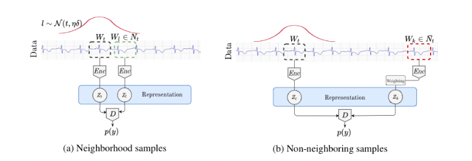

# Unsupervised Representation Learning for TimeSeries with Temporal Neighborhood Coding (TNC)



Time series are often complex and rich in information, but sparsely labeled andtherefore challenging to model. TNC is a self-supervised framework for learning representations for complex, multivariate non-stationary time series. This repository contains the implementation of this framework based on the original paper:

https://openreview.net/forum?id=8qDwejCuCN

Experiments can be done on 3 different datasets. You can create the simulated dataset using the following script:
```
python data/simulated_data.py
```
For the ECG waveform dataset, you need to download the raw recordings from the Physionet website. The module data/afib_data.py will preprocess the data and annotations for you. Same for the Human Activity Recognition (HAR) dataset, download the dataset from UCR website and use data/HAR_data.py module to process the data.

To train the TNC encoder model, simply run:
```
python -m tnc.tnc --data <DATASET_NAME> --train --w <DEBIASING_WEIGHT>
```
You can also evaluate downstream classification performance and clusterability, as follows:
```
python -m evaluations.classification_test --data <DATASET_NAME>
python -m evaluations.clusterability --data <DATASET_NAME>
```

